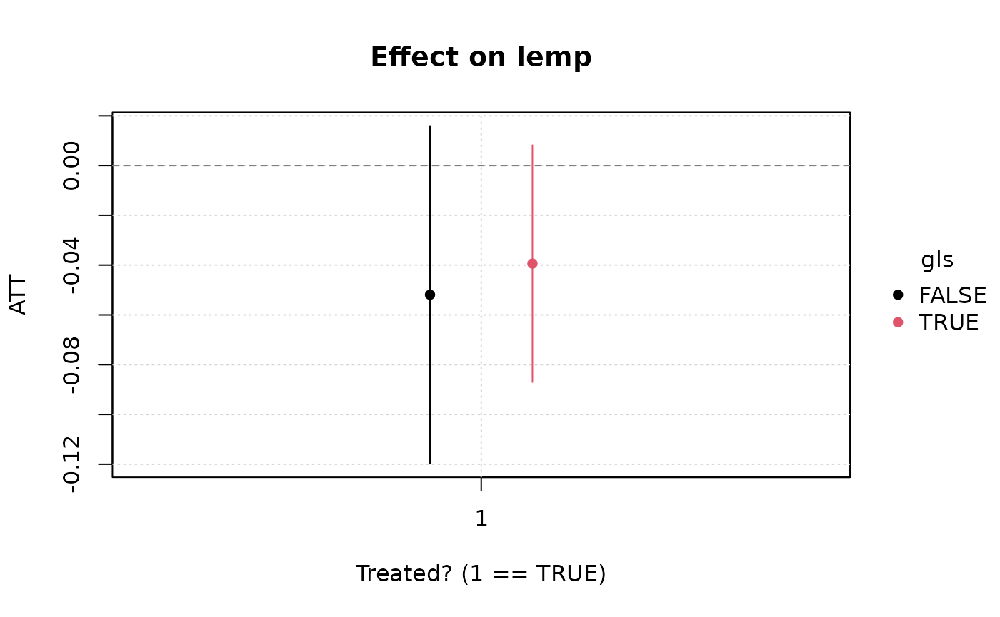

# Introduction to etwfe

## Background

A canonical research design for social scientists is the so-called
“difference-in-differences” (DiD) design. The essential idea behind DiD
is that we can estimate the causal impact of an intervention
(“treatment”) by comparing the pre- and post-intervention outcomes of
indivduals that received treatment (“treated” group) against the
outcomes of comparable indivduals that didn’t receive treatment
(“control” group).[¹](#fn1)

In the classic 2x2 DiD case (two units, two periods), a simple
interaction effect between two dummy variables suffices to recover the
treatment effect. In base R this might look something like:

``` r
lm(y ~ Dtreated_unit * Dpost_treatment, data = somedata)
```

where the resulting coefficient on the
`Dtreated_unitTRUE:Dpost_treatmentTRUE` interaction term represents the
treatment effect.

Rather than manually specify the interaction term, in practice
researchers often use an equivalent formulation known as *two-way fixed
effects* (TWFE). The core idea of TWFE is that we can subsume the
interaction term from the previous code chunk by adding unit and time
fixed effects. A single treatment dummy can then be used to capture the
effect of treatment directly. A TWFE regression in base R might look as
follows:

``` r
lm(y ~ Dtreat + factor(id) + factor(period), data = somedata)
```

where the treatment effect is now captured by the coefficient on the
`Dtreat` dummy.

The TWFE shortcut is especially nice for more complicated panel data
settings with multiple units and multiple times periods. Speaking of
which, if you prefer to use a dedicated fixed effects / panel data
package like **fixest**, you could also estimate the previous regression
like so:

``` r
library(fixest)
feols(y ~ Dtreat | id + period, data = somedata)
```

These TWFE regressions are easy to run and intuitive, and for a long
time everyone was happy. But it was too good to last. A cottage industry
of clever research now demonstrates that things are not quite so simple.
Among other things, the standard TWFE formulation can impose strange
(negative) weighting conditions on key parts of the estimation
procedure. One implication is that you risk a high probability of
estimate bias in the presence of staggered treatment rollouts, which are
very common in real-life applications.

Fortunately, just as econometricians were taking away one of our
favourite tools, they were kind enough to replace it with some new ones.
Among these, the proposed approach by Wooldridge
([2023](https://doi.org/10.1093/ectj/utad016),
[2025](https://doi.org/10.1007/s00181-025-02807-z)) is noteworthy. His
idea might be paraphrased as stating that the problem with TWFE is not
that we were doing it in the first place. Rather, it’s that we weren’t
doing it enough. Instead of only including a single treatment × time
interaction, Wooldridge recommends that we saturate our model with all
possible interactions between treatment and time variables, including
treatment cohorts, as well as other covariates. He goes on to show that
this approach actually draws an equivalence between different types of
estimators (pooled OLS, twoway Mundlak regression, etc.) So it’s not
entirely clear what to call it. But Wooldridge refers to the general
idea as as *extended* TWFE—or, ETWFE—which I rather like and is where
this package takes its name.

The Wooldridge ETWFE solution is intuitive and elegant. But it is also
rather tedious and error prone to code up manually. You have to
correctly specify all the possible interactions, demean control
variables within groups, and then recover the treatment effects of
interest via an appropriate marginal effect aggregation. The **etwfe**
package aims to simplify the process by providing convenience functions
that do all this work for you.

## Dataset

To demonstrate the core functionality of **etwfe**, we’ll use the
[`mpdta`](https://bcallaway11.github.io/did/reference/mpdta.html)
dataset on US teen employment from the **did** package (which you’ll
need to install separately).

``` r
# install.packages("did")
data("mpdta", package = "did")
head(mpdta)
#>     year countyreal     lpop     lemp first.treat treat
#> 866 2003       8001 5.896761 8.461469        2007     1
#> 841 2004       8001 5.896761 8.336870        2007     1
#> 842 2005       8001 5.896761 8.340217        2007     1
#> 819 2006       8001 5.896761 8.378161        2007     1
#> 827 2007       8001 5.896761 8.487352        2007     1
#> 937 2003       8019 2.232377 4.997212        2007     1
```

“Treatment” in this dataset refers to an increase in the minimum wage
rate. In the examples that follow, our goal is to estimate the effect of
this minimum wage treatment (`treat`) on the log of teen employment
(`lemp`). Notice that the panel ID is at the county level
(`countyreal`), but treatment was staggered across cohorts
(`first.treat`) so that a group of counties were treated at the same
time. In addition to these staggered treatment effects, we also observe
log population (`lpop`) as a potential control variable.

## Basic usage

Let’s load **etwfe** and work through its basic functionality. As we
shall see, the core workflow of the package involves two consecutive
function calls:

1.  [`etwfe()`](http://grantmcdermott.com/etwfe/reference/etwfe.md)
2.  [`emfx()`](http://grantmcdermott.com/etwfe/reference/emfx.md)

### `etwfe`

Given the package name, it won’t surprise you to learn that the key
estimating function is
[`etwfe()`](http://grantmcdermott.com/etwfe/reference/etwfe.md). Here’s
how it would look for our example dataset.

``` r
library(etwfe)

mod = etwfe(
  fml  = lemp ~ lpop, # outcome ~ controls
  tvar = year,        # time variable
  gvar = first.treat, # group variable
  data = mpdta,       # dataset
  vcov = ~countyreal  # vcov adjustment (here: clustered)
)
```

There are a few things to say about our
[`etwfe()`](http://grantmcdermott.com/etwfe/reference/etwfe.md) argument
choices and other function options, but we’ll leave those details aside
until a bit later. Right now, just know that all of the above arguments
are required except `vcov` (though I generally recommend it too, since
we probably want to cluster our standard errors at the individual unit
level).

Let’s take a look at our model object.

``` r
mod
#> OLS estimation, Dep. Var.: lemp
#> Observations: 2,500
#> Fixed-effects: first.treat: 4,  year: 5
#> Standard-errors: Clustered (countyreal) 
#>                         Estimate Std. Error   t value  Pr(>|t|)    
#> lpop                    1.065461   0.021824 48.821102 < 2.2e-16 ***
#> first.treat::2004:lpop  0.050982   0.037756  1.350320  0.177525    
#> first.treat::2006:lpop -0.041095   0.047390 -0.867183  0.386259    
#> first.treat::2007:lpop  0.055518   0.039212  1.415838  0.157447    
#> year::2004:lpop         0.011014   0.007554  1.458043  0.145458    
#> year::2005:lpop         0.020733   0.008104  2.558268  0.010814 *  
#> year::2006:lpop         0.010535   0.010816  0.974084  0.330487    
#> year::2007:lpop         0.020921   0.011808  1.771708  0.077053 .  
#> ... 14 coefficients remaining (display them with summary() or use argument n)
#> ... 10 variables were removed because of collinearity
#> (.Dtreat:first.treat::2006:year::2004, .Dtreat:first.treat::2006:year::2005 and 8 others
#> [full set in $collin.var])
#> ---
#> Signif. codes:  0 '***' 0.001 '**' 0.01 '*' 0.05 '.' 0.1 ' ' 1
#> RMSE: 0.537131     Adj. R2: 0.871722
#>                  Within R2: 0.869464
```

What [`etwfe()`](http://grantmcdermott.com/etwfe/reference/etwfe.md) has
done underneath the hood is construct a treatment dummy variable
`.Dtreat` and saturated it together with the other variables of interest
as a set of multiway interaction terms.[²](#fn2)

You may have noticed that our
[`etwfe()`](http://grantmcdermott.com/etwfe/reference/etwfe.md) call
returns a standard [**fixest**](https://lrberge.github.io/fixest/)
object, since this is what it uses to perform the underlying estimation.
All of the associated methods and functions from the **fixest** package
are thus compatible with our model object. For example, we could plot
the raw regression coefficients with
[`fixest::coefplot()`](https://lrberge.github.io/fixest/reference/coefplot.html),
or print them to a nice regression table with
[`fixest::etable()`](https://lrberge.github.io/fixest/reference/etable.html).
However, the raw coefficients from an
[`etwfe()`](http://grantmcdermott.com/etwfe/reference/etwfe.md)
estimation are not particularly meaningful in of themselves. Recall that
these are complex, multiway interaction terms that are probably hard to
to interpret on their own. This insight leads us to our next key
function…

### `emfx`

If the raw `etwfe` coefficients aren’t particularly useful by
themselves, what can we do with them instead? Well, we probably want to
aggregate them along some dimension of interest (e.g., by groups or
time, or as an event study). A natural way to perform these aggregations
is by recovering the appropriate marginal effects. The **etwfe** package
provides another convenience function for doing so:
[`emfx()`](http://grantmcdermott.com/etwfe/reference/emfx.md), which is
a thin(ish) wrapper around
[`marginaleffects::slopes()`](https://marginaleffects.com/man/r/slopes.html).

For example, we can recover the average treatment effect on the treated
(ATT) as follows.

``` r
emfx(mod)
#> 
#>  .Dtreat Estimate Std. Error     z Pr(>|z|)    S   2.5 %  97.5 %
#>     TRUE  -0.0506     0.0125 -4.05   <0.001 14.3 -0.0751 -0.0261
#> 
#> Term: .Dtreat
#> Type: response
#> Comparison: TRUE - FALSE
```

In other words, our model is telling us that an increase in the minimum
wage leads to an approximate 5 percent decrease in teen employment.

Beyond simple ATTs,
[`emfx()`](http://grantmcdermott.com/etwfe/reference/emfx.md) also
supports other types of aggregations via the `type` argument. For
example, we can use `type = "calendar"` to get ATTs by period, or
`type = "group"` to get ATTs by cohort groups. But the option that will
probably be useful to most people is `type = "event"`, which will
recover dynamic treatment effects *a la* an event study. Let’s try this
out and then save the resulting object, since I plan to reuse it in a
moment.

``` r
mod_es = emfx(mod, type = "event")
mod_es
#> 
#>  event Estimate Std. Error     z Pr(>|z|)    S   2.5 %   97.5 %
#>      0  -0.0332     0.0134 -2.48    0.013  6.3 -0.0594 -0.00702
#>      1  -0.0573     0.0171 -3.34   <0.001 10.2 -0.0910 -0.02373
#>      2  -0.1379     0.0308 -4.48   <0.001 17.0 -0.1982 -0.07753
#>      3  -0.1095     0.0323 -3.39   <0.001 10.5 -0.1729 -0.04620
#> 
#> Term: .Dtreat
#> Type: response
#> Comparison: TRUE - FALSE
```

Our event study suggests that the teen disemployment effect of a minimum
wage hike is fairly modest at first (3%), but increases over the next
few years (\>10%). In the next section, we’ll look at ways to
communicate this kind of finding to your audience.

### Presentation

#### Plots

As of **etwfe** v0.5.0, we provide a native `plot.emfx` method for
convenient visualization.

``` r
plot(mod_es)
```


Note that `emfx` only reports post-treatment effects here. That’s
because all pre-treatment effects have been swept out of the estimation
as a result of the ETWFE setup. Specifically, under the default setting
where the control group comprises the “not-yet” treated units, all
pre-treatment effects are mechanistically set to zero.[³](#fn3)
Alternatively, you can specify the “never” treated units as the control
group by first calling `etwfe(..., cgroup = "never")`. This *does*
return pre-treatment effects, albeit with the potential trade-off of
yielding less precise estimates from not using all available
information.

``` r
mod_es2 = etwfe(
  lemp ~ lpop, tvar = year, gvar = first.treat, data = mpdta, vcov = ~countyreal,
  cgroup = "never" # <= use never treated as control group
  ) |>
  emfx(type = "event")

plot(mod_es2)
```


Two final points about visualizing `emfx` objects. First, you can
customize your plots by overriding default arguments. We use
[**tinyplot**](https://grantmcdermott.com/tinyplot/) as a backend and
you should be able to pass through any valid argument that `tinyplot()`
understands. For example:

``` r
plot(
  mod_es2,
  type = "ribbon",
  col  = "darkcyan",
  xlab = "Years post treatment",
  main = "Minimum wage effect on (log) teen employment",
  sub  = "Note: Using never-treated as control group",
  # file = "event-study.png", width = 8, height = 5. ## uncomment to save file
)
```


Second, since `emfx` objects are essentially just data.frames with
additional attributes, you can easily use another plot engine if you’d
prefer. For example, assuming that you have **ggplot2** installed:

``` r
# install.packages("ggplot2")
library(ggplot2)
theme_set(
  theme_linedraw() + theme(panel.grid = element_blank())
)
ggplot(mod_es2, aes(x = event, y = estimate, ymin = conf.low, ymax = conf.high)) +
  geom_hline(yintercept = 0, lty = 2, col = "grey50") +
  geom_vline(xintercept = -1, lty = 2, col = "grey50") +
  geom_pointrange(col = "darkcyan") +
  labs(
    x = "Years post treatment",
    y = "ATT",
    title = "Effect on log teen employment",
    caption = "Note: Using never-treated as control group"
  )
```


#### Tables

We recommend the excellent
[**modelsummary**](https://modelsummary.com/index.html) package for
transforming your results into a nice regression table. (You will need
to install it first.) Note the use of the `shape` and `coef_rename`
arguments below; these are optional, but help to make the event-study
output look a bit cleaner.

``` r
# install.packages("modelsummary")
library(modelsummary)

# Quick renaming function to replace ".Dtreat" with something more meaningful
rename_fn = function(old_names) {
  new_names = gsub(".Dtreat", "Years post treatment =", old_names)
  setNames(new_names, old_names)
}

modelsummary(
  list(mod_es2, mod_es),
  shape       = term:event:statistic ~ model,
  coef_rename = rename_fn,
  gof_omit    = "Adj|Within|IC|RMSE",
  stars       = TRUE,
  title       = "Event study",
  notes       = "Std. errors are clustered at the county level"
)
```

|                                                              | \(1\)        | \(2\)        |
|--------------------------------------------------------------|--------------|--------------|
| Years post treatment = -4                                    | 0.007        |              |
|                                                              | (0.025)      |              |
| Years post treatment = -3                                    | 0.028        |              |
|                                                              | (0.018)      |              |
| Years post treatment = -2                                    | 0.023        |              |
|                                                              | (0.015)      |              |
| Years post treatment = -1                                    | 0.000        |              |
| Years post treatment = 0                                     | -0.021+      | -0.033\*     |
|                                                              | (0.011)      | (0.013)      |
| Years post treatment = 1                                     | -0.053\*\*\* | -0.057\*\*\* |
|                                                              | (0.016)      | (0.017)      |
| Years post treatment = 2                                     | -0.141\*\*\* | -0.138\*\*\* |
|                                                              | (0.032)      | (0.031)      |
| Years post treatment = 3                                     | -0.108\*\*   | -0.110\*\*\* |
|                                                              | (0.033)      | (0.032)      |
| Num.Obs.                                                     | 2500         | 2500         |
| R2                                                           | 0.873        | 0.873        |
| FE..first.treat                                              | X            | X            |
| FE..year                                                     | X            | X            |
| \+ p \< 0.1, \* p \< 0.05, \*\* p \< 0.01, \*\*\* p \< 0.001 |              |              |
| Std. errors are clustered at the county level                |              |              |

Event study

## Heterogeneous treatment effects

So far we’ve limited ourselves to homogeneous treatment effects, where
the impact of treatment (i.e., minimum wage hike) is averaged across all
US counties in our dataset. However, many research problems require us
to estimate treatment effects separately across groups and then,
potentially, test for differences between them. For example, we might
want to test whether the efficacy of a new vaccine differs across age
groups, or whether a marketing campaign was equally successful across
genders. The ETWFE framework naturally lends itself to these kinds of
heterogeneous treatment effects.

Consider the following example, where we first create a logical dummy
variable for all US counties in the eight [Great Lake states
(GLS)](https://en.wikipedia.org/wiki/Great_Lakes_region).

``` r
gls_fips = c("IL" = 17, "IN" = 18, "MI" = 26, "MN" = 27,
             "NY" = 36, "OH" = 39, "PA" = 42, "WI" = 55)

mpdta$gls = substr(mpdta$countyreal, 1, 2) %in% gls_fips
```

Now imagine that we are interested in estimating separate treatment
effects for GLS versus non-GLS counties. We do this simply by invoking
the optional `xvar` argument as part of our
[`etwfe()`](http://grantmcdermott.com/etwfe/reference/etwfe.md)
call.[⁴](#fn4) Any subsequent
[`emfx()`](http://grantmcdermott.com/etwfe/reference/emfx.md) call on
this object will automatically recognize that we want to recover
treatment effects by these two distinct groups.

``` r
hmod = etwfe(
  lemp ~ lpop, tvar = year, gvar = first.treat, data = mpdta,
  cgroup = "never",
  vcov = ~countyreal,
  xvar = gls           ## <= het. TEs by gls
)

# Simple heterogeneous ATTs (could also specify `type = "event"`, etc.) 
(hmod_mfx = emfx(hmod))
#> 
#>  .Dtreat   gls Estimate Std. Error     z Pr(>|z|)   S   2.5 % 97.5 %
#>     TRUE FALSE  -0.0511     0.0317 -1.61    0.107 3.2 -0.1133 0.0111
#>     TRUE  TRUE  -0.0366     0.0253 -1.44    0.149 2.7 -0.0862 0.0131
#> 
#> Term: .Dtreat
#> Type: response
#> Comparison: TRUE - FALSE
```

The above point estimates might tempt us to think that minimum wage
hikes caused less teen disemployment in GLS counties than in the rest of
the US on average. However, to test this formally we can invoke the
powerful
[`hypotheses`](https://marginaleffects.com/man/r/hypotheses.html)
infrastructure of the underlying **marginaleffects** package. Probably
the easiest way to do this is by using `b[i]`-style positional
arguments, where “`[i]`” denotes the row of the
[`emfx()`](http://grantmcdermott.com/etwfe/reference/emfx.md) return
object. Thus, by specifying `hypothesis = "b1 = b2"`, we can test
whether the ATTs from row 1 (non-GLS) and row 2 (GLS) are different from
one another.

``` r
emfx(hmod, hypothesis = "b1 = b2")
#> 
#>  Hypothesis Estimate Std. Error      z Pr(>|z|)   S  2.5 % 97.5 %
#>       b1=b2  -0.0145     0.0511 -0.285    0.776 0.4 -0.115 0.0856
#> 
#> Type: response
```

Here we see that there is actually no statistical difference in the
average disemployment effect between GLS and non-GLS counties. We can
also confirm this with a quick visual inspection (note that we get an
automatic legend, as well as dodged pointrange bars).

``` r
plot(hmod_mfx)
```



Interesting enough, however, the full event study reveals a more complex
picture. Would the non-GLS counties have recorded a larger employment
drop-off had we been able to collect more post-treatment data? We’ll let
the the reader decide…

``` r
hmod |>
  emfx("event") |>
  plot(type = "ribbon")
```


One final aside is that you can easily display the results of
heterogeneous treatment effects in table form too. Here’s a quick
example, where we again make use of the `modelsummary(..., shape = ...)`
argument.

``` r
modelsummary(
  models      = list("GLS county" = hmod_mfx),
  shape       = term + statistic ~ model + gls, # add xvar variable (here: gls)
  coef_map    = c(".Dtreat" = "ATT"),
  gof_map     = NA,
  title       = "Comparing the ATT on GLS and non-GLS counties"
)
```

|     | GLS county |         |
|-----|------------|---------|
|     | FALSE      | TRUE    |
| ATT | -0.051     | -0.037  |
|     | (0.032)    | (0.025) |

Comparing the ATT on GLS and non-GLS counties

While the simple example here has been limited to a binary comparison of
group  
ATTs, note the same logic carries over to richer settings. We can use
the exact same workflow to estimate heterogeneous treatment effects by
different aggregations (e.g., event studies) and across groups with many
levels.

## Other families

Another key feature of the ETWFE approach—one that sets it apart from
other advanced DiD implementations and extensions—is that it supports
nonlinear model (distribution / link) families. Users need simply invoke
the `family` argument. Here’s a brief example, where we recast our
earlier event-study as a Poisson regression.

``` r
mpdta$emp = exp(mpdta$lemp)

etwfe(
  emp ~ lpop, tvar = year, gvar = first.treat, data = mpdta, vcov = ~countyreal,
  family = "poisson"
  ) |>
  emfx("event")
#> 
#>  event Estimate Std. Error       z Pr(>|z|)    S  2.5 % 97.5 %
#>      0   -25.35       15.9 -1.5957  0.11056  3.2  -56.5   5.79
#>      1     1.09       40.3  0.0271  0.97838  0.0  -77.9  80.07
#>      2   -75.12       23.2 -3.2445  0.00118  9.7 -120.5 -29.74
#>      3  -101.82       27.1 -3.7590  < 0.001 12.5 -154.9 -48.73
#> 
#> Term: .Dtreat
#> Type: response
#> Comparison: TRUE - FALSE
```

## Performance tips

Thinking of the **etwfe** workflow again as a pair of consecutive
functional calls, the first
[`etwfe()`](http://grantmcdermott.com/etwfe/reference/etwfe.md) stage
tends to be very fast. We’re leveraging the incredible performance of
**fixest** and also taking some shortcuts to avoid wasting time on
nuisance parameters. See the [Regarding fixed
effects](#regarding-fixed-effects) section below for more details about
this.

For its part, the second
[`emfx()`](http://grantmcdermott.com/etwfe/reference/emfx.md) stage also
tends to be pretty performant. If your data has less than 100k rows,
it’s unlikely that you’ll have to wait more than a few seconds to obtain
results. However, `emfx`’s computation time does tend to scale
non-linearly with the size of the original data, as well as the number
of interactions from the underlying `etwfe` model object.[⁵](#fn5)

Fortunately, there are two complementary strategies that you can use to
speed things up. The first is to turn off the most expensive part of the
whole procedure—standard error calculation—by calling
`emfx(..., vcov = FALSE)`. This should bring the estimation time back
down to a few seconds or less, even for datasets in excess of a million
rows. Of course, the loss of standard errors might not be an acceptable
trade-off for projects where statistical inference is critical. But the
good news is that we “combine” turning off standard errors with a second
strategy. Specially, it turns out that compressing the data by groups
prior to estimation can yield substantial speed gains on its own; see
Wong *et al.* ([2021](https://doi.org/10.48550/arXiv.2102.11297)) on
this. Users can do this by invoking the `emfx(..., compress = TRUE)`
argument. While the effect here is not as dramatic as the first
strategy, collapsing the data does have the virtue of retaining
information about the standard errors. The trade-off this time, however,
is that compressing our data does lead to a loss in accuracy for our
estimated parameters. On the other hand, testing suggests that this loss
in accuracy tends to be relatively minor, with results equivalent up to
the 1st or 2nd significant decimal place (or even better).

Summarizing, here is a quick plan of attack for you to try if you are
worried about the estimation time for large datasets and models:

0.  Estimate `mod = etwfe(...)` as per usual.
1.  Run `emfx(mod, vcov = FALSE, ...)`.
2.  Run `emfx(mod, vcov = FALSE, compress = TRUE, ...)`.
3.  Compare the point estimates from steps 1 and 2. If they are are
    similar enough to your satisfaction, get the approximate standard
    errors by running `emfx(mod, compress = TRUE, ...)`.

It’s a bit of performance art, since all of the examples in this
vignette complete very quickly anyway. But here is a reworking of our
earlier event study example to demonstrate this performance-conscious
workflow.

``` r
# Step 0 already complete: using the same `mod` object from earlier...

# Step 1
emfx(mod, type = "event", vcov = FALSE)
#> 
#>  event Estimate
#>      0  -0.0332
#>      1  -0.0573
#>      2  -0.1379
#>      3  -0.1095
#> 
#> Term: .Dtreat
#> Type: response
#> Comparison: TRUE - FALSE

# Step 2
emfx(mod, type = "event", vcov = FALSE, compress = TRUE)
#> 
#>  event Estimate
#>      0  -0.0332
#>      1  -0.0573
#>      2  -0.1379
#>      3  -0.1095
#> 
#> Term: .Dtreat
#> Type: response
#> Comparison: TRUE - FALSE

# Step 3: Results from 1 and 2 are similar enough, so get approx. SEs
mod_es_compressed = emfx(mod, type = "event", compress = TRUE)
```

To put a fine point on it, we can can compare our original event study
with the compressed estimates and see that the results are indeed very
similar.

``` r
modelsummary(
  list("Original" = mod_es, "Compressed" = mod_es_compressed),
  shape       = term:event:statistic ~ model,
  coef_rename = rename_fn,
  gof_omit    = "Adj|Within|IC|RMSE",
  title       = "Event study",
  notes       = "Std. errors are clustered at the county level"
)
```

|                                               | Original | Compressed |
|-----------------------------------------------|----------|------------|
| Years post treatment = 0                      | -0.033   | -0.033     |
|                                               | (0.013)  | (0.013)    |
| Years post treatment = 1                      | -0.057   | -0.057     |
|                                               | (0.017)  | (0.017)    |
| Years post treatment = 2                      | -0.138   | -0.138     |
|                                               | (0.031)  | (0.031)    |
| Years post treatment = 3                      | -0.110   | -0.110     |
|                                               | (0.032)  | (0.032)    |
| Num.Obs.                                      | 2500     | 2500       |
| R2                                            | 0.873    | 0.873      |
| FE..first.treat                               | X        | X          |
| FE..year                                      | X        | X          |
| Std. errors are clustered at the county level |          |            |

Event study

## Under the hood

Now that you’ve seen **etwfe** in action, let’s circle back to what the
package is doing under the hood. This section isn’t necessary for you to
use the package; feel free to skip it. But a review of the internal
details should help you to optimize for different scenarios and also
give you a better understanding of **etwfe’s** default choices.

### Manual implementation

As I keep reiterating, the ETWFE approach basically involves saturating
the regression with interaction effects. You can easily grab the formula
of an estimated model to see for yourself.

``` r
mod$fml_all
#> $linear
#> lemp ~ .Dtreat:i(first.treat, i.year, ref = 0, ref2 = 2003)/lpop_dm + 
#>     lpop + i(first.treat, lpop, ref = 0) + i(year, lpop, ref = 2003)
#> <environment: 0x55c1cad23a30>
#> 
#> $fixef
#> ~first.treat + year
```

At this point, however, you may notice a few things. The first is that
our formula references several variables that aren’t in the original
dataset. An obvious one is the `.Dtreat` treatment dummy. A more subtle
one is `lpop_dm`, which is the *demeaned* (i.e., group-centered) version
of our `lpop` control variable. All control variables have to be
demeaned before they are interacted in the ETWFE setting. Here’s how you
could have constructed the dataset ahead of time and estimated the ETWFE
regression manually:

``` r
# First construct the dataset
mpdta2 = mpdta |>
  transform(
    .Dtreat = year >= first.treat & first.treat != 0,
    lpop_dm = ave(lpop, first.treat, FUN = \(x) x - mean(x, na.rm = TRUE))
  )

# Then estimate the manual version of etwfe
mod2 = fixest::feols(
  lemp ~ .Dtreat:i(first.treat, i.year, ref = 0, ref2 = 2003) / lpop_dm |
    first.treat[lpop] + year[lpop],
  data = mpdta2,
  vcov = ~countyreal
)
```

We can confirm that the manual approach yields the same output as our
original etwfe regression. I’ll use **modelsummary** to do that here,
since I’ve already loaded it above.[⁶](#fn6).

``` r
modelsummary(
  list("etwfe" = mod, "manual" = mod2),
  gof_map = NA # drop all goodness-of-fit info for brevity
)
```

|                                                      | etwfe   | manual  |
|------------------------------------------------------|---------|---------|
| lpop                                                 | 1.065   |         |
|                                                      | (0.022) |         |
| first.treat = 2004 × lpop                            | 0.051   |         |
|                                                      | (0.038) |         |
| first.treat = 2006 × lpop                            | -0.041  |         |
|                                                      | (0.047) |         |
| first.treat = 2007 × lpop                            | 0.056   |         |
|                                                      | (0.039) |         |
| year = 2004 × lpop                                   | 0.011   |         |
|                                                      | (0.008) |         |
| year = 2005 × lpop                                   | 0.021   |         |
|                                                      | (0.008) |         |
| year = 2006 × lpop                                   | 0.011   |         |
|                                                      | (0.011) |         |
| year = 2007 × lpop                                   | 0.021   |         |
|                                                      | (0.012) |         |
| .Dtreat × first.treat = 2004 × year = 2004           | -0.021  | -0.021  |
|                                                      | (0.022) | (0.022) |
| .Dtreat × first.treat = 2004 × year = 2005           | -0.082  | -0.082  |
|                                                      | (0.027) | (0.027) |
| .Dtreat × first.treat = 2004 × year = 2006           | -0.138  | -0.138  |
|                                                      | (0.031) | (0.031) |
| .Dtreat × first.treat = 2004 × year = 2007           | -0.110  | -0.110  |
|                                                      | (0.032) | (0.032) |
| .Dtreat × first.treat = 2006 × year = 2006           | 0.003   | 0.003   |
|                                                      | (0.019) | (0.019) |
| .Dtreat × first.treat = 2006 × year = 2007           | -0.045  | -0.045  |
|                                                      | (0.022) | (0.022) |
| .Dtreat × first.treat = 2007 × year = 2007           | -0.046  | -0.046  |
|                                                      | (0.018) | (0.018) |
| .Dtreat × first.treat = 2004 × year = 2004 × lpop_dm | 0.005   | 0.005   |
|                                                      | (0.018) | (0.018) |
| .Dtreat × first.treat = 2004 × year = 2005 × lpop_dm | 0.025   | 0.025   |
|                                                      | (0.018) | (0.018) |
| .Dtreat × first.treat = 2004 × year = 2006 × lpop_dm | 0.051   | 0.051   |
|                                                      | (0.021) | (0.021) |
| .Dtreat × first.treat = 2004 × year = 2007 × lpop_dm | 0.011   | 0.011   |
|                                                      | (0.027) | (0.027) |
| .Dtreat × first.treat = 2006 × year = 2006 × lpop_dm | 0.039   | 0.039   |
|                                                      | (0.016) | (0.016) |
| .Dtreat × first.treat = 2006 × year = 2007 × lpop_dm | 0.038   | 0.038   |
|                                                      | (0.022) | (0.022) |
| .Dtreat × first.treat = 2007 × year = 2007 × lpop_dm | -0.020  | -0.020  |
|                                                      | (0.016) | (0.016) |

To transform these raw coefficients into their more meaningful ATT
counterparts, we just need to perform the appropriate marginal effects
operation. For example, here’s how we can get both the simple ATTs and
event-study ATTs from earlier. This is what
[`emfx()`](http://grantmcdermott.com/etwfe/reference/emfx.md) is doing
behind the scenes.

``` r
library(marginaleffects)

# Simple ATT
slopes(
  mod2, 
  newdata   = subset(mpdta2, .Dtreat), # we only want rows where .Dtreat is TRUE
  variables = ".Dtreat", 
  by        = ".Dtreat"
)
#> 
#>  .Dtreat Estimate Std. Error     z Pr(>|z|)    S   2.5 %  97.5 %
#>     TRUE  -0.0506     0.0125 -4.05   <0.001 14.3 -0.0751 -0.0261
#> 
#> Term: .Dtreat
#> Type: response
#> Comparison: TRUE - FALSE

# Event study
slopes(
  mod2, 
  newdata   = transform(subset(mpdta2, .Dtreat), event = year - first.treat),
  variables = ".Dtreat", 
  by        = "event"
)
#> 
#>  event Estimate Std. Error     z Pr(>|z|)    S   2.5 %   97.5 %
#>      0  -0.0332     0.0134 -2.48    0.013  6.3 -0.0594 -0.00701
#>      1  -0.0573     0.0172 -3.34   <0.001 10.2 -0.0910 -0.02373
#>      2  -0.1379     0.0308 -4.48   <0.001 17.0 -0.1982 -0.07751
#>      3  -0.1095     0.0323 -3.39   <0.001 10.5 -0.1729 -0.04619
#> 
#> Term: .Dtreat
#> Type: response
#> Comparison: TRUE - FALSE
```

### Regarding fixed effects

Let’s switch gears and talk about fixed effects quickly. If you are a
regular **fixest** user, you may have noticed that we’ve been invoking
its [varying
slopes](https://lrberge.github.io/fixest/articles/fixest_walkthrough.html#varying-slopes-fex)
syntax in the fixed effect slot (i.e., `first.treat[lpop]` and
`year[lpop]`). The reason for this is part practical, part
philosophical. From a practical perspective, `factor_var[numeric_var]`
is equivalent to base R’s `factor_var/numeric_var` “nesting” syntax but
is much faster for high-dimensional factors.[⁷](#fn7) From a
philosophical perspective, **etwfe** tries to limit the amount of
extraneous information that it reports to users. Most of the interaction
effects in the ETWFE framework are just acting as controls. By
relegating them to the fixed effects slot, we can avoid polluting the
user’s console with a host of extra coefficients. Nonetheless, we can
control this behaviour with the `fe` (“fixed effects”) argument.
Consider the following options and their manual equivalents.

``` r
# fe = "feo" (fixed effects only)
mod_feo = etwfe(
  lemp ~ lpop, tvar = year, gvar = first.treat, data = mpdta, vcov = ~countyreal,
  fe = "feo"
)
# ... which is equivalent to the manual regression
mod_feo2 = fixest::feols(
  lemp ~ .Dtreat:i(first.treat, i.year, ref = 0, ref2 = 2003) / lpop_dm +
    lpop + i(first.treat, lpop, ref = 0) + i(year, lpop, ref = 2003) |
    first.treat + year,
  data = mpdta2, vcov = ~countyreal
)

# fe = "none"
mod_none = etwfe(
  lemp ~ lpop, tvar = year, gvar = first.treat, data = mpdta, vcov = ~countyreal,
  fe = "none"
)
# ... which is equivalent to the manual regression
mod_none2 = fixest::feols(
  lemp ~ .Dtreat:i(first.treat, i.year, ref = 0, ref2 = 2003) / lpop_dm +
    lpop + i(first.treat, lpop, ref = 0) + i(year, lpop, ref = 2003) +
    i(first.treat, ref = 0) + i(year, ref = 2003),
  data = mpdta2, vcov = ~countyreal
)
```

I’ll leave it up to you to pass any of these models to `emfx` to confirm
that they give correct aggregated treatment effects. But we can quickly
demonstrate in a regression table that they all return the same raw
coefficients.

``` r
mods = list(
  "etwfe"         = mod,
  "manual"        = mod2,
  "etwfe (feo)"   = mod_feo,
  "manual (feo)"  = mod_feo2,
  "etwfe (none)"  = mod_none,
  "manual (none)" = mod_none2
)

modelsummary(mods, gof_map = NA)
```

|                                                      | etwfe   | manual  | etwfe (feo) | manual (feo) | etwfe (none) | manual (none) |
|------------------------------------------------------|---------|---------|-------------|--------------|--------------|---------------|
| lpop                                                 | 1.065   |         | 1.065       | 1.065        | 1.065        | 1.065         |
|                                                      | (0.022) |         | (0.022)     | (0.022)      | (0.022)      | (0.022)       |
| first.treat = 2004 × lpop                            | 0.051   |         | 0.051       | 0.051        | 0.051        | 0.051         |
|                                                      | (0.038) |         | (0.038)     | (0.038)      | (0.038)      | (0.038)       |
| first.treat = 2006 × lpop                            | -0.041  |         | -0.041      | -0.041       | -0.041       | -0.041        |
|                                                      | (0.047) |         | (0.047)     | (0.047)      | (0.047)      | (0.047)       |
| first.treat = 2007 × lpop                            | 0.056   |         | 0.056       | 0.056        | 0.056        | 0.056         |
|                                                      | (0.039) |         | (0.039)     | (0.039)      | (0.039)      | (0.039)       |
| year = 2004 × lpop                                   | 0.011   |         | 0.011       | 0.011        | 0.011        | 0.011         |
|                                                      | (0.008) |         | (0.008)     | (0.008)      | (0.008)      | (0.008)       |
| year = 2005 × lpop                                   | 0.021   |         | 0.021       | 0.021        | 0.021        | 0.021         |
|                                                      | (0.008) |         | (0.008)     | (0.008)      | (0.008)      | (0.008)       |
| year = 2006 × lpop                                   | 0.011   |         | 0.011       | 0.011        | 0.011        | 0.011         |
|                                                      | (0.011) |         | (0.011)     | (0.011)      | (0.011)      | (0.011)       |
| year = 2007 × lpop                                   | 0.021   |         | 0.021       | 0.021        | 0.021        | 0.021         |
|                                                      | (0.012) |         | (0.012)     | (0.012)      | (0.012)      | (0.012)       |
| .Dtreat × first.treat = 2004 × year = 2004           | -0.021  | -0.021  | -0.021      | -0.021       | -0.021       | -0.021        |
|                                                      | (0.022) | (0.022) | (0.022)     | (0.022)      | (0.022)      | (0.022)       |
| .Dtreat × first.treat = 2004 × year = 2005           | -0.082  | -0.082  | -0.082      | -0.082       | -0.082       | -0.082        |
|                                                      | (0.027) | (0.027) | (0.027)     | (0.027)      | (0.027)      | (0.027)       |
| .Dtreat × first.treat = 2004 × year = 2006           | -0.138  | -0.138  | -0.138      | -0.138       | -0.138       | -0.138        |
|                                                      | (0.031) | (0.031) | (0.031)     | (0.031)      | (0.031)      | (0.031)       |
| .Dtreat × first.treat = 2004 × year = 2007           | -0.110  | -0.110  | -0.110      | -0.110       | -0.110       | -0.110        |
|                                                      | (0.032) | (0.032) | (0.032)     | (0.032)      | (0.032)      | (0.032)       |
| .Dtreat × first.treat = 2006 × year = 2006           | 0.003   | 0.003   | 0.003       | 0.003        | 0.003        | 0.003         |
|                                                      | (0.019) | (0.019) | (0.019)     | (0.019)      | (0.019)      | (0.019)       |
| .Dtreat × first.treat = 2006 × year = 2007           | -0.045  | -0.045  | -0.045      | -0.045       | -0.045       | -0.045        |
|                                                      | (0.022) | (0.022) | (0.022)     | (0.022)      | (0.022)      | (0.022)       |
| .Dtreat × first.treat = 2007 × year = 2007           | -0.046  | -0.046  | -0.046      | -0.046       | -0.046       | -0.046        |
|                                                      | (0.018) | (0.018) | (0.018)     | (0.018)      | (0.018)      | (0.018)       |
| .Dtreat × first.treat = 2004 × year = 2004 × lpop_dm | 0.005   | 0.005   | 0.005       | 0.005        | 0.005        | 0.005         |
|                                                      | (0.018) | (0.018) | (0.018)     | (0.018)      | (0.018)      | (0.018)       |
| .Dtreat × first.treat = 2004 × year = 2005 × lpop_dm | 0.025   | 0.025   | 0.025       | 0.025        | 0.025        | 0.025         |
|                                                      | (0.018) | (0.018) | (0.018)     | (0.018)      | (0.018)      | (0.018)       |
| .Dtreat × first.treat = 2004 × year = 2006 × lpop_dm | 0.051   | 0.051   | 0.051       | 0.051        | 0.051        | 0.051         |
|                                                      | (0.021) | (0.021) | (0.021)     | (0.021)      | (0.021)      | (0.021)       |
| .Dtreat × first.treat = 2004 × year = 2007 × lpop_dm | 0.011   | 0.011   | 0.011       | 0.011        | 0.011        | 0.011         |
|                                                      | (0.027) | (0.027) | (0.027)     | (0.027)      | (0.027)      | (0.027)       |
| .Dtreat × first.treat = 2006 × year = 2006 × lpop_dm | 0.039   | 0.039   | 0.039       | 0.039        | 0.039        | 0.039         |
|                                                      | (0.016) | (0.016) | (0.016)     | (0.016)      | (0.016)      | (0.016)       |
| .Dtreat × first.treat = 2006 × year = 2007 × lpop_dm | 0.038   | 0.038   | 0.038       | 0.038        | 0.038        | 0.038         |
|                                                      | (0.022) | (0.022) | (0.022)     | (0.022)      | (0.022)      | (0.022)       |
| .Dtreat × first.treat = 2007 × year = 2007 × lpop_dm | -0.020  | -0.020  | -0.020      | -0.020       | -0.020       | -0.020        |
|                                                      | (0.016) | (0.016) | (0.016)     | (0.016)      | (0.016)      | (0.016)       |
| (Intercept)                                          |         |         |             |              | 2.260        | 2.260         |
|                                                      |         |         |             |              | (0.088)      | (0.088)       |
| first.treat = 2004                                   |         |         |             |              | 0.038        | 0.038         |
|                                                      |         |         |             |              | (0.154)      | (0.154)       |
| first.treat = 2006                                   |         |         |             |              | 0.461        | 0.461         |
|                                                      |         |         |             |              | (0.213)      | (0.213)       |
| first.treat = 2007                                   |         |         |             |              | -0.286       | -0.286        |
|                                                      |         |         |             |              | (0.167)      | (0.167)       |
| year = 2004                                          |         |         |             |              | -0.090       | -0.090        |
|                                                      |         |         |             |              | (0.031)      | (0.031)       |
| year = 2005                                          |         |         |             |              | -0.110       | -0.110        |
|                                                      |         |         |             |              | (0.033)      | (0.033)       |
| year = 2006                                          |         |         |             |              | -0.052       | -0.052        |
|                                                      |         |         |             |              | (0.040)      | (0.040)       |
| year = 2007                                          |         |         |             |              | -0.057       | -0.057        |
|                                                      |         |         |             |              | (0.045)      | (0.045)       |

A final point to note about fixed effects is that **etwfe** defaults to
using group-level (i.e., cohort-level) fixed effects like `first.treat`,
rather than unit-level fixed effects like `countyreal`. This design
decision reflects a neat ancillary result in Wooldridge (2025), which
proves the equivalence between the two types of fixed effects for linear
cases. Group-level effects have the virtue of being faster to estimate,
since there are fewer factor levels. Moreover, they are *required* for
nonlinear model families like Poisson per the underlying ETWFE theory.
Still, you can specify unit-level fixed effects for the linear case
through the `ivar` argument. Again, we can easily confirm that this
yields the same estimated treatment effects as the group-level default
(although the standard errors will be slightly different).

``` r
mod_es_i = etwfe(
  lemp ~ lpop, tvar = year, gvar = first.treat, data = mpdta,
  ivar = countyreal  # NEW: Use unit-level (county) FEs
  ) |>
  emfx("event")

modelsummary(
  list("Group-level FEs (default)" = mod_es, "Unit-level FEs" = mod_es_i),
  shape       = term:event:statistic ~ model,
  coef_rename = rename_fn,
  gof_omit    = "Adj|Within|IC|RMSE"
)
```

|                          | Group-level FEs (default) | Unit-level FEs |
|--------------------------|---------------------------|----------------|
| Years post treatment = 0 | -0.033                    | -0.033         |
|                          | (0.013)                   | (0.013)        |
| Years post treatment = 1 | -0.057                    | -0.057         |
|                          | (0.017)                   | (0.023)        |
| Years post treatment = 2 | -0.138                    | -0.138         |
|                          | (0.031)                   | (0.045)        |
| Years post treatment = 3 | -0.110                    | -0.110         |
|                          | (0.032)                   | (0.045)        |
| Num.Obs.                 | 2500                      | 2500           |
| R2                       | 0.873                     | 0.993          |
| FE..year                 | X                         | X              |
| FE..first.treat          | X                         |                |
| FE..countyreal           |                           | X              |

------------------------------------------------------------------------

1.  Good textbook introductions to DiD are available
    [here](https://theeffectbook.net/ch-DifferenceinDifference.html) and
    [here](https://mixtape.scunning.com/09-difference_in_differences),
    among many other places.

2.  It has also demeaned the `lpop` control variable, but that again is
    something we’ll get back too later. It’s not particularly important
    for interpreting the final results.

3.  This obviously means that our ETWFE result here cannot be used for
    interrogating pre-treatment fit (say, a visual inspection for
    parallel pre-trends). To force return these “zero” pre-treatment
    effects, you can invoke the `emfx(..., post_only = TRUE)` argument.
    But it should be emphasized that doing so is *strictly*
    performative. Again, pre-treatment effects are zero by estimation
    design if the not-yet treated units are used as the control group.

4.  Note that the “x” prefix in “xvar” represents a covariate that is
    *interacted* (×) with treatment, as opposed to a regular control
    variable (which could obviously be included as part of the `fml`
    RHS.

5.  Without getting too deep into the weeds, we are relying on a
    numerical delta method of the (excellent) **marginaleffects**
    package underneath the hood to recover the ATTs of interest. This
    method requires estimating two prediction models for *each*
    coefficient in the model and then computing their standard errors.
    So it’s a potentially expensive operation that can push the
    computation time for large datasets (\> 1m rows) up to several
    minutes or longer.

6.  Another option would be to use
    [`fixest::etable()`](https://lrberge.github.io/fixest/reference/etable.html)

7.  We won’t see a speed-up for this small dataset, but it can make a
    significant difference for large datasets.
